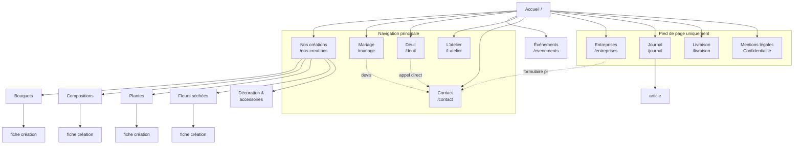

# 01 — Architecture du site

> Phase 1 : vitrine + contact. Toutes les décisions d'URL sont prises pour survivre
> à la phase 2 (click & collect) et à la phase 3 (e-commerce) **sans redirection**.
>
> **Mise à jour 2026-08-23** : ajout de `/evenements` et de la catégorie
> `/nos-creations/decoration`. La page d'accueil est spécifiée en détail dans
> `04-page-accueil.md`, qui fait foi sur la navigation et les libellés.

## Principe directeur

Site local de petite taille → **le plus plat possible**. 2 niveaux, 3 clics maximum
pour atteindre n'importe quelle page. 5 entrées en navigation principale.

Une seule exception à la platitude : les créations, structurées en
`/nos-creations/{categorie}/{slug}` — parce que cette arborescence **est déjà celle de
la future boutique**. Une fiche création d'aujourd'hui devient une fiche produit demain,
à la même URL, en ajoutant un prix et un bouton.

## Arborescence (phase 1)

```
Accueil (/)
├── Nos créations (/nos-creations)
│   ├── Bouquets (/nos-creations/bouquets)
│   │   └── {fiche création} (/nos-creations/bouquets/{slug})
│   ├── Compositions (/nos-creations/compositions)
│   │   └── {fiche création} (/nos-creations/compositions/{slug})
│   ├── Plantes (/nos-creations/plantes)
│   │   └── {fiche création} (/nos-creations/plantes/{slug})
│   ├── Fleurs séchées (/nos-creations/fleurs-sechees)
│   │   └── {fiche création} (/nos-creations/fleurs-sechees/{slug})
│   └── Décoration & accessoires (/nos-creations/decoration)
│       └── {fiche création} (/nos-creations/decoration/{slug})
├── Mariage (/mariage)
├── Deuil (/deuil)
├── Événements (/evenements)
├── Entreprises & abonnements (/entreprises)
├── L'atelier (/l-atelier)
├── Journal (/journal)
│   └── {article} (/journal/{slug})
├── Livraison & zone desservie (/livraison)
├── Contact (/contact)
├── Mentions légales (/mentions-legales)
└── Politique de confidentialité (/politique-de-confidentialite)
```

**16 pages au lancement** (hors fiches création et articles), dont 5 pages de catégorie.
Prévoir **6 à 10 fiches création** signature pour l'ouverture — pas plus : mieux vaut
10 vraies photos que 40 fiches vides.

## Sitemap visuel



## Table des URLs

| Page | URL | Parent | Emplacement nav | Priorité | Objectif |
|---|---|---|---|---|---|
| Accueil | `/` | — | Header (logo) | **Haute** | Venir en boutique |
| Nos créations | `/nos-creations` | Accueil | Header + menu | **Haute** | Donner envie, montrer le style |
| Bouquets | `/nos-creations/bouquets` | Créations | Menu déroulant | Haute | Requêtes bouquet |
| Compositions | `/nos-creations/compositions` | Créations | Menu déroulant | Moyenne | Requêtes composition |
| Plantes | `/nos-creations/plantes` | Créations | Menu déroulant | Moyenne | Requêtes plantes |
| Fleurs séchées | `/nos-creations/fleurs-sechees` | Créations | Menu déroulant | Haute | Niche non couverte localement |
| Décoration & accessoires | `/nos-creations/decoration` | Créations | Menu déroulant | Moyenne | Vases, poteries, objets |
| Fiche création | `/nos-creations/{cat}/{slug}` | Catégorie | Grille | Moyenne | Prépare le e-commerce |
| Mariage | `/mariage` | Accueil | Header | **Haute** | Devis qualifié — **bouquets uniquement** |
| Deuil | `/deuil` | Accueil | Header | **Haute** | Appel immédiat |
| Événements | `/evenements` | Accueil | Bloc accueil + footer | Moyenne | Baptêmes, anniversaires, réceptions |
| Entreprises | `/entreprises` | Accueil | Footer + bloc accueil | Moyenne | Abonnement récurrent |
| L'atelier | `/l-atelier` | Accueil | Header | Haute | Différenciation, confiance |
| Journal | `/journal` | Accueil | Footer (→ header quand ≥ 6 articles) | Moyenne | SEO longue traîne |
| Article | `/journal/{slug}` | Journal | Liste | Moyenne | SEO longue traîne |
| Livraison | `/livraison` | Accueil | Footer + bloc accueil | Moyenne | Requêtes « livraison + commune » |
| Contact | `/contact` | Accueil | Header + CTA | **Haute** | Conversion |
| Mentions légales | `/mentions-legales` | Accueil | Footer | Basse | Obligation légale |
| Confidentialité | `/politique-de-confidentialite` | Accueil | Footer | Basse | Obligation RGPD |

### Conventions d'URL — à figer maintenant

- Tout en **minuscules**, mots séparés par des **tirets**, jamais d'underscore.
- **Sans slash final** (`/mariage`, pas `/mariage/`) — choisir et forcer par redirection 301.
- Pas d'accents, pas d'apostrophes dans les slugs : `/l-atelier`, pas `/l'atelier`.
- Pas de date dans les URLs d'articles : `/journal/fleurs-de-saison-automne`,
  pas `/journal/2026/10/fleurs-de-saison`.
- Un seul parent pour les créations. Ne jamais introduire `/boutique/...` en parallèle
  de `/nos-creations/...` : ce serait de la cannibalisation pure.

## Navigation

### En-tête (desktop)

```
[Logo Matlo'Fleurs]   Nos créations ▾   Mariage   Deuil   L'atelier   Contact   [📞 02 XX XX XX XX]
```

- **5 entrées + 1 CTA.** Le CTA est le **numéro de téléphone**, pas un bouton
  « Commander » — en phase 1 la conversion est un appel ou une visite.
- Menu déroulant « Nos créations » : Bouquets · Compositions · Plantes · Fleurs séchées ·
  Décoration & accessoires · *Voir toutes les créations*.
- **« Deuil » reste visible en clair dans la nav**, jamais caché dans un déroulant :
  quelqu'un qui vient de perdre un proche scanne la page en 3 secondes.
- Le logo utilise la déclinaison **horizontale ou submark**, jamais le logo vertical
  complet (Updock illisible en petit — cf. `.claude/CLAUDE.md`, Known Pitfalls).

### Barre d'information (au-dessus de l'en-tête, optionnelle)

Une ligne fine crème sur bleu nuit :
`Ouvert aujourd'hui jusqu'à 19h · 30 rue de Saint-Jean-de-Monts, Challans · 02 XX XX XX XX`
Sert aussi de bandeau d'annonce (ouverture, Saint-Valentin, fête des mères, fermeture).

### En-tête (mobile)

- Logo submark à gauche, **icône téléphone en click-to-call** à droite (toujours visible,
  jamais dans le menu), burger à l'extrême droite.
- Menu plein écran, fond bleu nuit, entrées en Cinzel capitales (jamais en Updock).
- Dans le menu ouvert : les 5 entrées, puis un bloc secondaire (Événements, Entreprises,
  Journal, Livraison), puis adresse + horaires + réseaux.

### Pied de page — 4 colonnes

| Nos créations | Occasions | La maison | Infos pratiques |
|---|---|---|---|
| Bouquets | Mariage | L'atelier | 30 rue de Saint-Jean-de-Monts, 85300 Challans |
| Compositions | Deuil | Journal | Horaires |
| Plantes | Événements | Contact | Téléphone |
| Fleurs séchées | Abonnement floral | | Livraison & zone desservie |
| Décoration & accessoires | | | |

Sous les colonnes : logo vertical (seul endroit du site où il a la place de respirer),
baseline « Artisan Fleuriste », réseaux sociaux, puis ligne légale
`© 2026 Matlo'Fleurs · Mentions légales · Politique de confidentialité`.

### Fil d'Ariane

Sur toutes les pages sauf l'accueil. Doit refléter exactement l'URL :

| URL | Fil d'Ariane |
|---|---|
| `/nos-creations/bouquets` | Accueil > Nos créations > Bouquets |
| `/nos-creations/bouquets/coeur-de-saison` | Accueil > Nos créations > Bouquets > Cœur de saison |
| `/mariage` | Accueil > Mariage |
| `/journal/fleurs-de-saison-automne` | Accueil > Journal > Fleurs de saison, l'automne |

Balisage `BreadcrumbList` obligatoire (cf. `03-seo-local.md`).

## Maillage interne

### Pages piliers et satellites

| Pilier | Satellites qui pointent vers lui | Ce que le pilier renvoie |
|---|---|---|
| `/mariage` | Articles journal mariage, `/nos-creations/bouquets`, page d'accueil | Formulaire de devis, `/l-atelier`, réalisations |
| `/deuil` | Page d'accueil, `/livraison`, footer | Téléphone, `/contact`, `/livraison` |
| `/nos-creations` | Accueil, toutes les fiches, articles saison | Les 4 catégories, `/l-atelier` |
| `/l-atelier` | Accueil, mariage, toutes les catégories | `/nos-creations`, `/contact`, `/journal` |
| `/livraison` | Footer, accueil, deuil, fiches création | `/contact`, `/nos-creations` |

### Règles

1. **Aucune page orpheline.** Chaque fiche création est atteignable depuis sa catégorie
   ET depuis au moins un bloc « créations similaires ».
2. **Ancres descriptives.** « voir nos bouquets de saison », jamais « cliquez ici ».
3. **3 liens contextuels minimum** dans le corps de chaque page longue (mariage, deuil,
   atelier, articles).
4. **`/l-atelier` doit être la page la plus maillée du site** après l'accueil : c'est
   elle qui porte la différenciation, il faut que Google la comprenne comme centrale.
5. Chaque article du journal pointe vers **une** page de conversion (mariage, deuil,
   créations ou contact) — jamais vers les quatre.

## Séquence de mise en ligne

L'arborescence ci-dessus est la **cible**. Elle ne sort pas d'un bloc : la page d'accueil
part seule à l'ouverture, les pages s'ajoutent ensuite une par une. Le mécanisme complet
(navigation par ancres, sections en deux états, ordre d'ajout) est décrit dans
`04-page-accueil.md`, **partie E**.

En résumé :

| Étape | En ligne | Navigation |
|---|---|---|
| **Ouverture** | `/` + `/mentions-legales` + `/politique-de-confidentialite` (+ `/deuil` recommandé) | Ancres `#creations` `#occasions` `#atelier` `#boutique` |
| Puis, une par une | `/deuil` → `/mariage` → `/nos-creations` + catégories → `/l-atelier` → `/contact` → `/entreprises` et `/evenements` → `/livraison` → `/journal` | Chaque ancre devient une URL, sans redirection |

Deux règles :
- **Aucun lien vers une page qui n'existe pas.** Un lien mort à l'ouverture coûte plus
  cher qu'une ancre.
- **Aucune page vide publiée pour « avoir la page ».** Une page mince est un signal
  négatif ; une ancre qui fonctionne n'en est pas un.

## Évolutivité : ce qui change en phase 2 et 3

### Phase 2 — click & collect

Aucune URL existante ne bouge. On ajoute :

```
/nos-creations/{cat}/{slug}   → + prix ferme, + sélecteur de taille, + bouton « Réserver »
/panier
/commande
/commande/confirmation
/mon-compte  (optionnel)
```

Conditions à respecter **dès maintenant** pour que ça marche :
- La fiche création est déjà conçue comme une fiche produit : un visuel principal +
  2-3 secondaires, un nom, une description, une fourchette de prix, une taille, une
  saisonnalité, un CTA. Seul le CTA change.
- La taxonomie des 5 catégories est figée dès la phase 1. **Ne pas la faire évoluer**
  ensuite : chaque changement de catégorie = une redirection.
- Prévoir dans le modèle de contenu les champs qui ne servent pas encore :
  `prix`, `stock`, `délai_de_préparation`, `disponible_en_click_and_collect`.

### Phase 3 — e-commerce complet

Ajouts : `/livraison` devient un hub avec des pages par commune
(`/livraison/{commune}` — Sallertaine, Soullans, Le Perrier, Bois-de-Céné,
Saint-Christophe-du-Ligneron, Saint-Gervais, Beauvoir-sur-Mer, Saint-Jean-de-Monts,
Saint-Hilaire-de-Riez, Commequiers…). **À ne créer que quand il y a du contenu réel
et différencié par commune** — sinon ce sont des pages satellites que Google déclasse.

**Le deuil ne passe jamais en e-commerce.** Même en phase 3, le parcours reste
téléphone + rendez-vous. C'est un choix de marque, pas une limite technique.
